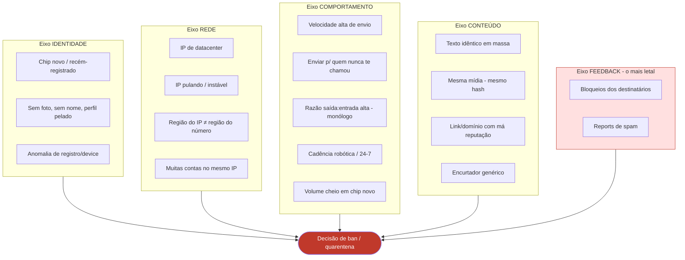
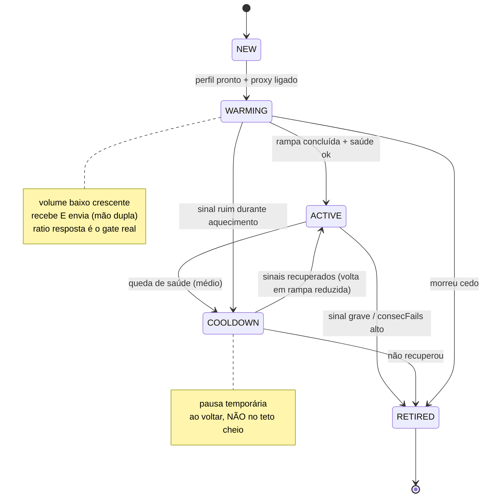
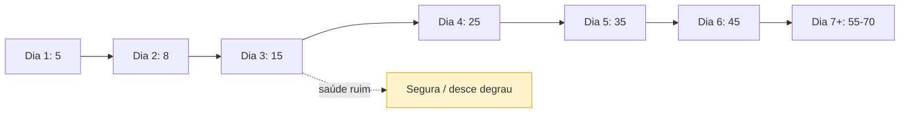
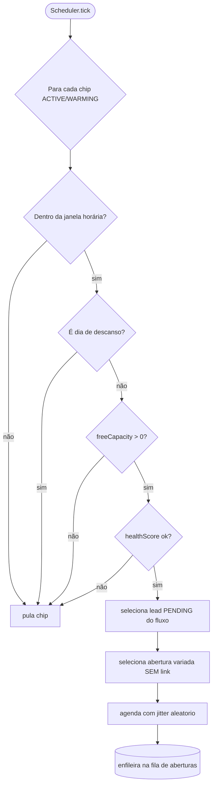
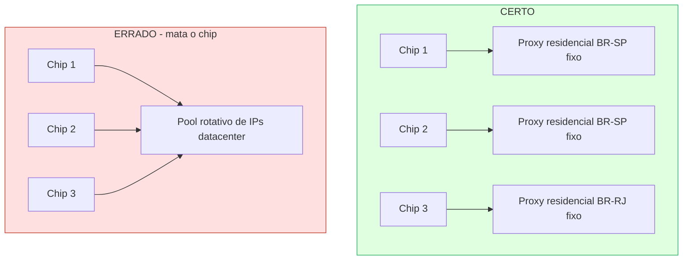
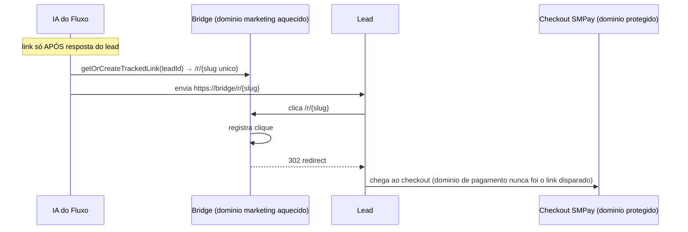
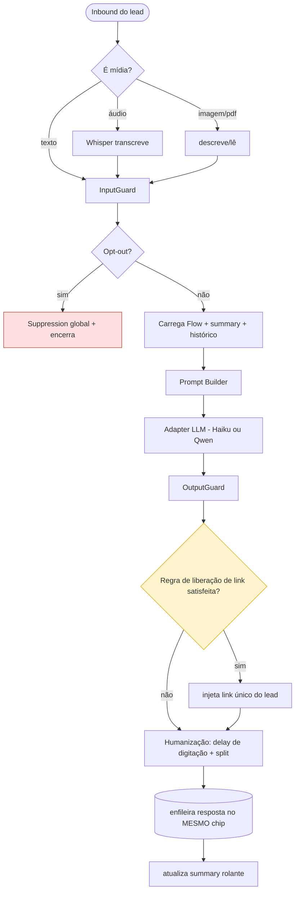
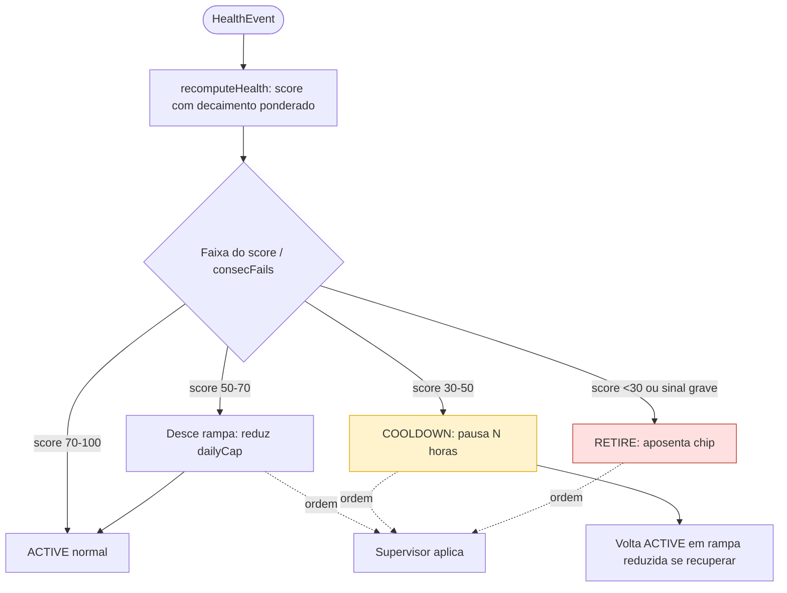
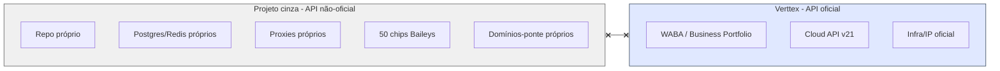

# Arquitetura Anti-Ban + Módulo de IA Conversacional

> Companion da especificação principal. Foco: **manter os chips vivos** e detalhar o módulo `ai/`.
> Filosofia: defesa em camadas. Nenhuma camada sozinha salva o chip — o que salva é o conjunto, e o sinal mais forte de todos é **conversa de mão dupla numa base morna**.

---

## 1. Modelo mental: o que derruba um chip

Antes de defender, é preciso saber contra o quê. O antispam do WhatsApp é um classificador que junta sinais. Eles se agrupam em cinco eixos:



**Hierarquia de letalidade:** Feedback (block/report) > Comportamento > Rede > Conteúdo > Identidade. Reportes derrubam mais rápido que qualquer outra coisa — por isso base morna e opt-out não são "compliance chato", são sobrevivência direta do chip.

---

## 2. Defesa em camadas (visão geral)

Cada eixo de risco tem uma camada de controle correspondente. O sistema implementa todas.

```mermaid
flowchart LR
    subgraph L0[CAMADA 0 · Isolamento]
        direction TB
        Z[Firewall total vs WABA oficial Verttex]
    end
    subgraph L1[CAMADA 1 · Identidade]
        direction TB
        A[Perfil maduro + chip envelhecido]
    end
    subgraph L2[CAMADA 2 · Rede]
        direction TB
        B[Proxy estável 1:1, residencial, região casada]
    end
    subgraph L3[CAMADA 3 · Comportamento]
        direction TB
        C[Rampa + teto + janela + jitter + variância]
    end
    subgraph L4[CAMADA 4 · Conteúdo]
        direction TB
        D[Variação real + mídia variada + bridge/slug]
    end
    subgraph L5[CAMADA 5 · Conversa - mais forte]
        direction TB
        E[Base morna + IA mão dupla]
    end
    subgraph L6[CAMADA 6 · Monitoramento]
        direction TB
        F[Health score + kill switch]
    end

    L0 --> L1 --> L2 --> L3 --> L4 --> L5 --> L6
    style L5 fill:#e0ffe0,stroke:#27ae60
    style L0 fill:#e0e8ff,stroke:#2c3e50
```



---

## 3. Matriz sinal → controle → ação

| Eixo | Sinal de risco | Controle de engenharia | Onde mora no sistema |
|---|---|---|---|
| Identidade | chip novo no volume cheio | rampa de aquecimento | `Scheduler` + `WhatsappNumber.rampDay/dailyCap` |
| Identidade | perfil pelado | setup obrigatório de foto/nome/business | `chips/:id/pair` + checklist |
| Rede | IP datacenter / instável | proxy residencial **estável** 1:1 | `Proxy` + `Session.bindProxy` |
| Rede | região IP ≠ número | proxy com `region` casando | `Proxy.region` validado no bind |
| Comportamento | velocidade alta | teto diário + jitter | `Scheduler.freeCapacity/nextJitterDelay` |
| Comportamento | cadência robótica/24-7 | janela comercial + variância por chip | `WhatsappNumber.windowStart/End` |
| Comportamento | monólogo (saída:entrada) | **conversa de mão dupla via IA** | `Conversational Engine` |
| Conteúdo | texto idêntico | variação real (não spintax) | `OpeningMessage` + IA generativa |
| Conteúdo | mesma mídia | variação de mídia / hash | content layer |
| Conteúdo | link de má reputação | bridge domain + slug único + warming | `TrackedLink` + `bridgeDomain` |
| Conteúdo | checkout queimado | nunca disparar domínio de pagamento | regra de bridge |
| Feedback | report/block | **opt-out instantâneo + base morna** | `Suppression` + warmth |
| Todos | degradação silenciosa | health monitor + kill switch | `HealthEvent` + `Supervisor` |
| Correlação | respingar no oficial | isolamento total de infra | Camada 0 |

---

## 4. Ciclo de vida do chip (máquina de estados)



**Regra de ouro:** o gate para sair de WARMING não é só "mandou X mensagens", é a **taxa de resposta**. Chip que dispara e ninguém responde não está aquecendo — está sinalizando spam. Base morna é o que torna o aquecimento real.

---

## 5. Rampa de aquecimento (curva)

Curva ilustrativa de `dailyCap` por dia de vida do chip. Valores são ponto de partida — calibre pela taxa de resposta observada.

| Dia (rampDay) | Teto de aberturas/dia | Observação |
|---:|---:|---|
| 1 | 5 | só inicia se perfil + proxy ok |
| 2 | 8 | observar read receipts |
| 3 | 15 | observar taxa de resposta |
| 4 | 25 | se resposta saudável, segue |
| 5 | 35 | — |
| 6 | 45 | — |
| 7+ | 55–70 (teto estável) | só chega aqui com saúde verde |

Princípios da curva:
- **Nunca pular degraus.** Saúde ruim num degrau → não sobe, ou desce.
- **Variância entre chips.** Os 50 não seguem a curva idêntica — pequena variação por chip evita que a frota inteira mostre o mesmo fingerprint estatístico.
- **Volta de COOLDOWN reinicia mais abaixo**, não no teto.



---

## 6. Cadência e capacidade (scheduler)

O scheduler nunca "sorteia chip e dispara". Ele respeita a agenda própria de cada chip.



Pseudocódigo do núcleo:

```ts
freeCapacity(chip) = chip.dailyCap - chip.sentToday   // dailyCap derivado da rampa
inWindow(chip, now) = now.hourLocal in [windowStart, windowEnd)
canSend(chip) = chip.status in [ACTIVE, WARMING]
             && inWindow(chip, now)
             && !isRestDay(chip, now)
             && freeCapacity(chip) > 0
             && chip.healthScore >= SOFT_THRESHOLD

nextDelay = rand(JITTER_MIN, JITTER_MAX) * perChipFactor(chip)
// perChipFactor dá variância individual: a frota não envia em uníssono
```

Regras anti-padrão embutidas:
- Intervalo entre envios do **mesmo chip** é sempre aleatório (jitter), nunca fixo.
- Janela comercial only — nada de 3h da manhã.
- Volume diário e horário variam **entre dias** e **entre chips**.

---

## 7. Camada de rede (proxy) — o erro mais comum



Regras:
- **1 IP : 1 número, estável.** WhatsApp quer estabilidade de sessão. Número pulando IP/país = parece conta roubada → verificação de segurança/ban.
- **Residencial ou móvel**, nunca datacenter.
- **Região casada**: número BR → IP BR (idealmente mesma UF). Mismatch é flag.
- **Não compartilhar IP** entre muitos chips.
- Proxy também tem saúde: se cai/instável, o chip sofre — monitore.

> Aqui se confunde "rotacionar". Você rotaciona **números** (qual chip envia qual abertura). Você **nunca** rotaciona o IP de um número já logado.

---

## 8. Camada de identidade

- **Perfil maduro por chip**: foto, nome, descrição business-ish. Chip pelado grita descartável.
- **Aquecimento não é só enviar**: chip que também recebe mensagens, participa de conversa, parece humano. A base morna entrega isso naturalmente (eles respondem).
- **Auth state persistido** (Postgres + backup). Perder = re-pareamento (QR de novo), que é dor operacional **e** um evento de re-login = leve sinal de risco. Minimize re-logins.

---

## 9. Camada de conteúdo

### 9.1. Variação de texto (real, não esqueleto)
- Ruim: `{Oi|Olá} {nome}, {tudo bem|como vai}?` → mesma mensagem com sinônimos, detectável.
- Bom: estruturas genuinamente diferentes. As aberturas (`OpeningMessage`) são variadas de fábrica; nas respostas, a IA gera conteúdo contextual por lead, naturalmente único.

### 9.2. Mídia
- Não mandar a **mesma imagem** (mesmo hash) pra todo mundo. Varie, ou gere variações.

### 9.3. Reputação de link (consolidado)



Regras de reputação:
- Link **só depois** da resposta — nunca na abertura. Isso tira o link do padrão "mesma URL em milhares de chats".
- **Slug único por lead** → string sempre diferente, mata o fingerprint de URL repetida.
- **Domínio-ponte de marketing**, aquecido como chip, HTTPS, WHOIS de negócio. Poucos domínios próprios aquecidos > muitos novos.
- **Checkout (pagamento) nunca é o link compartilhado** — é só o destino do 302. Protege a reputação da infra de pagamento.
- Sem encurtador genérico.

---

## 10. Camada conversacional = módulo `ai/` (a defesa mais forte)

A razão saída:entrada é o sinal comportamental mais perigoso. Conversa de mão dupla numa base morna o inverte: o chip passa a **receber** tanto quanto envia, parecendo humano. Por isso o módulo de IA não é só "converter" — é **proteção de chip**.

### 10.1. Pipeline conversacional



### 10.2. Prompt Builder — contrato

```ts
buildPrompt(flow: Flow, conv: Conversation, incoming: Message): LLMMessages {
  return [
    { role: 'system', content: compose(
        flow.systemPrompt,            // persona + objetivo do produto
        renderKnowledge(flow.knowledgeBase),
        guardDirectives(flow.guardRules),
        linkPolicy(flow.linkReleaseRule, conv.linkSent)
    )},
    ...flow.fewShotExamples,          // exemplos de tom/abordagem
    { role: 'system', content: `Resumo da conversa até agora: ${conv.summary}` },
    ...recentTurns(conv, N),          // últimas N trocas (janela limitada)
    { role: 'user', content: incoming.content }
  ];
}
```

### 10.3. Formato do `knowledgeBase` (por produto)

```json
{
  "produto": "Código Sena",
  "promessa": "...",
  "preco": "R$ ...",
  "garantia": "7 dias ...",
  "bonus": ["..."],
  "objecoes": [
    { "objecao": "é caro", "resposta": "..." },
    { "objecao": "funciona mesmo?", "resposta": "..." }
  ],
  "faq": [ { "q": "...", "a": "..." } ],
  "tom": "próximo, direto, sem hype exagerado",
  "gatilho_link": "após lead demonstrar interesse claro OU pedir o link"
}
```

### 10.4. Few-shot (por produto)
Lista de `{role, content}` com 2–4 mini-conversas exemplares mostrando: abertura → objeção → contorno → liberação de link. É o que "treina" a IA daquele produto sem fine-tuning.

### 10.5. Adapters (interface comum)

```ts
interface LLMAdapter {
  generate(messages: LLMMessages, cfg: GenCfg): Promise<string>;
}
class HaikuAdapter implements LLMAdapter { /* Anthropic */ }
class QwenAdapter  implements LLMAdapter { /* vLLM/Runpod */ }
// Seleção por flow.aiModel
```

### 10.6. Guards

**InputGuard** (antes da IA):
- Detecta **opt-out** (palavras-gatilho) → supressão imediata.
- Detecta abuso/injeção/prompt hacking.
- Detecta off-topic extremo / mensagem vazia.

**OutputGuard** (depois da IA, antes de enviar):
- **Bloqueia link se a regra de liberação não foi satisfeita** (link nunca na abertura/cedo demais).
- Anti-overpromise (não prometer o que o produto não entrega).
- Tom/comprimento dentro do esperado do Fluxo.
- **Anti-repetição**: evita que o modelo caia em frases idênticas entre leads (preserva variação de conteúdo → protege chip).

### 10.7. Humanização (também é anti-ban)
- **Delay de digitação** proporcional ao tamanho da resposta + jitter (responder no tempo de um humano, não em 200ms).
- **Split** de respostas longas em 2–3 balões naturais.
- Presença `composing` opcional (baixo valor, mas inofensiva).
- Latência de resposta dentro de janela humana (não responder instantaneamente 100% das vezes).

### 10.8. Summary rolante
- Mantém contexto limitado: a cada N trocas, condensa o histórico em `conversation.summary`, preservando fatos-chave (interesse, objeções já tratadas, se link foi enviado). Evita estourar contexto e mantém custo baixo.

---

## 11. Health Monitor + Kill Switch (detecção de degradação)

API não-oficial **não** entrega evento limpo de "fui bloqueado". A saúde é **inferida** por sinais indiretos.

### 11.1. Sinais

| Sinal | Como inferir | Peso |
|---|---|---|
| `SEND_FAIL` | erro explícito no envio | alto |
| `NO_DELIVERY` | sem ack de entrega na janela | médio |
| `NO_READ` | entregue mas sem read por muito tempo, em série | médio |
| `REPLY_DROP` | queda brusca na taxa de resposta do chip | **alto** (forte proxy de block/mute) |
| `DISCONNECT` | sessão caindo repetidamente | médio |
| `RECOVERED` | sinais voltando ao normal | recupera score |

### 11.2. Algoritmo de score e ação



```ts
// esboço
recomputeHealth(chip) {
  chip.healthScore = clamp(chip.healthScore - sum(eventWeightsSince(lastDecay))
                                            + recoveryBonus(timeHealthy), 0, 100);
}
applyPolicy(chip) {
  if (chip.healthScore < RETIRE || chip.consecFails >= MAX_FAILS) retire(chip);
  else if (chip.healthScore < COOLDOWN) cooldown(chip);
  else if (chip.healthScore < SOFT) reduceRamp(chip);
}
```

**Prioridade absoluta:** ação de saúde manda mais que meta de envio. Kill switch pausa/derruba **um** chip isoladamente (graças à arquitetura worker+supervisor), sem afetar os vizinhos nem contaminar o padrão da frota.

---

## 12. Camada 0 — Isolamento (o firewall)



Nenhuma ponte: sem credencial, IP, device fingerprint, número de contato ou deploy compartilhado. Se o cinza queimar, **não há caminho de correlação** até o ativo oficial. Esse é o risco que mais pesa — perder chip é barato; perder o WABA oficial não é.

---

## 13. Anti-patterns (o que NÃO fazer)

| ❌ Anti-pattern | Por que mata | ✅ Faça |
|---|---|---|
| Rotacionar IP de chip logado | parece conta roubada | IP estável 1:1 |
| Base fria / comprada | reports → ban rápido | só base morna |
| Spintax (sinônimos) | mesma msg detectável | variação estrutural real |
| Link na abertura | URL em massa = spam | link só após resposta |
| Mesma imagem pra todos | hash repetido | mídia variada |
| Chip novo no teto | flag clássica | rampa gradual |
| Enviar 24/7 | cadência não-humana | janela comercial + jitter |
| Disparar e ignorar respostas | monólogo, ratio péssimo | IA conversa sempre |
| Auth state só em disco efêmero | re-login constante | persistir em DB + backup |
| Ignorar opt-out | acumula report | supressão global imediata |
| Compartilhar infra com oficial | respinga no WABA | isolamento total |

---

## 14. Checklist operacional pré-disparo

**Por chip:**
- [ ] Perfil com foto + nome + descrição
- [ ] Proxy residencial estável ligado, região casada
- [ ] Auth state persistido e com backup
- [ ] Rampa configurada (começa baixo)
- [ ] Janela comercial definida

**Por fluxo:**
- [ ] Aberturas variadas (real), **sem link**, pedindo resposta
- [ ] Persona + knowledgeBase + few-shot configurados
- [ ] Regra de liberação de link definida
- [ ] Domínio-ponte aquecido (não o de pagamento)

**Global:**
- [ ] Lista de supressão ativa e cruzada no import
- [ ] Health monitor + kill switch rodando
- [ ] Isolamento vs Verttex verificado (sem nenhuma ponte)

---

> **Em uma frase:** o chip sobrevive quando parece um humano numa conversa real — identidade madura, IP estável, ritmo humano, conteúdo único, base morna que responde, e um monitor que puxa o chip da linha no primeiro sinal de degradação; tudo isolado do ativo oficial.
