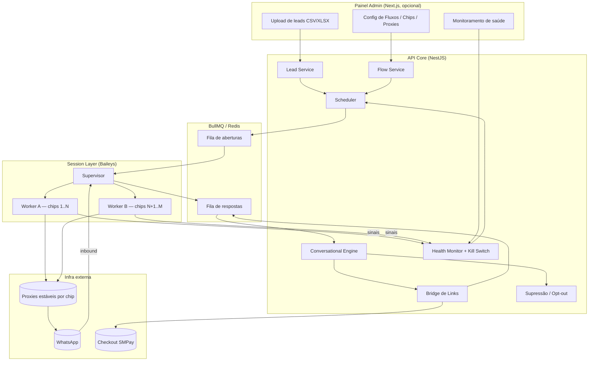

# Motor de Disparo WhatsApp (API não-oficial) — Especificação Técnica Completa

> Documento de build para Claude Code. Projeto **standalone**, 100% separado do Verttex.
> Verttex = API oficial (Cloud API). Este projeto = API não-oficial (Baileys). **Zero credencial, IP, identidade ou infra compartilhada entre os dois.**
> Codinome usado aqui: `dispatch-engine` (renomeie à vontade).

---

## 0. Princípios de design (não-negociáveis)

Estes princípios são restrições de arquitetura. Qualquer decisão de implementação que os viole está errada por definição.

1. **Isolamento total da Verttex.** Repo separado, deploy separado, banco separado, Redis separado, proxies separados, números separados. Nenhuma referência a credenciais, WABA, device fingerprint ou contatos do Verttex. Se o canal cinza queimar, não pode existir caminho de correlação até o ativo oficial.
2. **Base morna apenas.** O sistema é desenhado para leads que já interagiram (responderam, compraram, opt-in). Não é ferramenta de cold-blast para lista comprada/raspada. A qualidade da base é o fator nº 1 de sobrevivência dos chips.
3. **Conversa de mão dupla, não monólogo.** Abertura curta que pede resposta → IA conversa → link só depois da resposta. O sistema nunca dispara link na primeira mensagem.
4. **Saúde por chip acima de volume.** Cada número tem rampa, teto e monitor de saúde. Na dúvida, o sistema envia menos. Kill switch automático tem prioridade sobre meta de envio.
5. **Opt-out é sagrado.** Pedido de saída (`sair`, `parar`, `pare`, `descadastrar`, etc.) move o lead para supressão permanente, em todos os fluxos, imediatamente. Lista de supressão é global e nunca é violada.
6. **Reputação de domínio protegida.** O domínio de pagamento (checkout) nunca é o link disparado. Sempre passa por domínio-ponte de marketing, com slug único por lead.

---

## 1. Visão geral

O sistema dispara mensagens de abertura personalizadas para uma base morna de leads via WhatsApp (API não-oficial), e a partir da resposta do lead conduz uma conversa com IA até o objetivo do fluxo (normalmente: levar ao checkout de um produto). Tudo é organizado em **Fluxos**.

### 1.1. Conceito central: Fluxo (Flow)

Um **Fluxo** = um produto. Cada Fluxo encapsula tudo que é específico daquele produto:

- Persona e configuração da IA (system prompt, base de conhecimento do produto, exemplos, modelo).
- Conjunto de mensagens de abertura (variadas).
- Base de leads associada.
- Domínio-ponte e regra de geração de slug/link.
- Regras de envio (rampa, teto, janela de horário) — podem herdar do default global ou sobrescrever.
- Objetivo e regra de liberação do link (quando a IA pode mandar o checkout).

Como são poucos produtos, cada Fluxo tem uma IA "treinada" (na prática: system prompt + knowledge base + few-shot, não fine-tuning) dedicada àquele produto. Trocar de produto = criar/configurar outro Fluxo, sem tocar no resto.

---

## 2. Stack

| Camada | Tecnologia | Observação |
|---|---|---|
| Runtime/API | Node.js + **NestJS** (TypeScript) | mesma fluência do Verttex, codebase novo |
| ORM | **Prisma** | schema próprio |
| Banco | **PostgreSQL** | instância isolada |
| Filas | **BullMQ + Redis** | scheduler e jobs de envio |
| Transporte WhatsApp | **Baileys** (multi-device, WebSocket) | NÃO usar libs baseadas em browser (Venom/WPPConnect) — inviável em 50 sessões |
| LLM | Anthropic **Haiku 4.5** e/ou **Qwen3-30B** (vLLM/Runpod) | seleção por Fluxo |
| Transcrição áudio | **Whisper** | inbound de áudio do lead |
| TTS (opcional) | **ElevenLabs** | resposta em áudio, se o Fluxo pedir |
| Storage mídia | **Cloudflare R2** (ou equivalente) | mídia de entrada/saída |
| Proxy | Residencial/móvel, **IP estável por número** | NÃO datacenter, NÃO rotativo por sessão |
| Deploy | Railway/VPS **isolado** | sem relação com infra Verttex |

---

## 3. Arquitetura de alto nível



**Separação de processos:**
- **API Core** (NestJS): orquestra, expõe endpoints, roda scheduler, conversational engine, health, bridge.
- **Session Workers** (processos/containers separados): cada worker mantém um subconjunto de sessões Baileys. Um **Supervisor** coordena, faz health-check e reinicia sessões individualmente.
- **Redis** medeia Core ↔ Workers (jobs de envio e eventos inbound).

Motivo: se um worker cair, derruba só o subconjunto dele, não os 50 chips. E o kill switch precisa pausar/derrubar 1 chip sem afetar os outros.

---

## 4. Modelo de dados (Prisma)

```prisma
// ============ FLUXOS / PRODUTOS ============
model Flow {
  id              String   @id @default(cuid())
  name            String                  // ex: "Código Sena", "MLA"
  slug            String   @unique        // identificador curto
  status          FlowStatus @default(DRAFT)

  // IA do produto
  aiModel         String                  // "claude-haiku-4-5" | "qwen3-30b" ...
  systemPrompt    String   @db.Text       // persona + objetivo do produto
  knowledgeBase   String   @db.Text       // oferta, preço, garantia, objeções, FAQ
  fewShotExamples Json                    // [{role, content}] exemplos de conversa
  guardRules      Json                    // regras Input/OutputGuard específicas

  // Regra de liberação de link
  linkReleaseRule Json                    // condições p/ IA poder mandar checkout
  bridgeDomain    String                  // domínio-ponte de marketing deste fluxo
  checkoutBaseUrl String                  // URL final do checkout (SMPay)

  // Config de envio (sobrescreve default global se setado)
  sendConfig      Json?                   // {dailyCapPerChip, window, rampCurve, jitterMs}

  openingMessages OpeningMessage[]
  leads           Lead[]
  conversations   Conversation[]
  createdAt       DateTime @default(now())
  updatedAt       DateTime @updatedAt
}

enum FlowStatus { DRAFT ACTIVE PAUSED ARCHIVED }

model OpeningMessage {
  id        String   @id @default(cuid())
  flowId    String
  flow      Flow     @relation(fields: [flowId], references: [id])
  // Template de abertura. Deve pedir resposta. SEM link.
  template  String   @db.Text             // suporta variáveis {nome}, etc.
  weight    Int      @default(1)          // peso na seleção aleatória
  active    Boolean  @default(true)
}

// ============ CHIPS (NÚMEROS) ============
model WhatsappNumber {
  id            String   @id @default(cuid())
  label         String                    // apelido interno
  phone         String   @unique          // E.164
  status        ChipStatus @default(NEW)

  // Auth Baileys (persistido — NUNCA só em filesystem)
  authState     Json?                     // creds + keys serializados
  authStateRef  String?                   // ou ponteiro p/ blob externo

  // Rampa / capacidade
  rampDay       Int      @default(0)      // dia atual da curva de aquecimento
  dailyCap      Int      @default(0)      // teto efetivo de hoje (derivado da rampa)
  sentToday     Int      @default(0)
  lastResetAt   DateTime?                 // reset diário do contador

  // Janela e cadência
  windowStart   Int      @default(9)      // hora local de início (comercial)
  windowEnd     Int      @default(20)
  restDays      Json?                     // dias de descanso

  // Saúde
  healthScore   Float    @default(100)
  consecFails   Int      @default(0)
  lastSignalAt  DateTime?

  // Proxy (estável!)
  proxyId       String?
  proxy         Proxy?   @relation(fields: [proxyId], references: [id])

  // Identidade
  profileName   String?
  hasPhoto      Boolean  @default(false)

  messages      Message[]
  healthEvents  HealthEvent[]
  createdAt     DateTime @default(now())
  updatedAt     DateTime @updatedAt
}

enum ChipStatus { NEW WARMING ACTIVE PAUSED COOLDOWN RETIRED }

model Proxy {
  id        String   @id @default(cuid())
  host      String
  port      Int
  username  String?
  password  String?
  type      String                        // "residential" | "mobile"
  region    String                        // ex: "BR-SP" (casar com o número)
  active    Boolean  @default(true)
  numbers   WhatsappNumber[]
}

// ============ LEADS ============
model Lead {
  id            String   @id @default(cuid())
  flowId        String
  flow          Flow     @relation(fields: [flowId], references: [id])
  phone         String                    // E.164
  name          String?
  meta          Json?                     // campos livres do CSV
  source        String?                   // origem da base (rastreabilidade)
  warmth        Warmth   @default(WARM)   // base morna por padrão
  status        LeadStatus @default(PENDING)
  slug          String   @unique          // slug único p/ link deste lead
  importBatchId String?
  conversation  Conversation?
  suppressed    Boolean  @default(false)
  createdAt     DateTime @default(now())

  @@unique([flowId, phone])               // dedup por fluxo
  @@index([status])
}

enum Warmth { WARM ENGAGED CUSTOMER }
enum LeadStatus { PENDING QUEUED OPENED REPLIED CONVERSING CONVERTED LOST SUPPRESSED }

model ImportBatch {
  id          String   @id @default(cuid())
  flowId      String
  filename    String
  totalRows   Int
  validRows   Int
  duplicates  Int
  invalid     Int
  createdAt   DateTime @default(now())
}

// ============ CONVERSAS / MENSAGENS ============
model Conversation {
  id          String   @id @default(cuid())
  flowId      String
  flow        Flow     @relation(fields: [flowId], references: [id])
  leadId      String   @unique
  lead        Lead     @relation(fields: [leadId], references: [id])
  state       ConvState @default(WAITING_REPLY)
  summary     String?  @db.Text           // resumo rolante p/ contexto
  linkSent    Boolean  @default(false)
  handoff     Boolean  @default(false)    // escalou p/ humano
  messages    Message[]
  updatedAt   DateTime @updatedAt
}

enum ConvState { WAITING_REPLY ACTIVE LINK_RELEASED CONVERTED CLOSED HANDOFF }

model Message {
  id           String   @id @default(cuid())
  conversationId String?
  conversation Conversation? @relation(fields: [conversationId], references: [id])
  chipId       String?
  chip         WhatsappNumber? @relation(fields: [chipId], references: [id])
  direction    Direction               // IN | OUT
  type         MsgType                 // TEXT | AUDIO | IMAGE | PDF
  content      String   @db.Text
  mediaUrl     String?
  waMessageId  String?
  deliveredAt  DateTime?
  readAt       DateTime?
  failed       Boolean  @default(false)
  failReason   String?
  createdAt    DateTime @default(now())
  @@index([chipId, createdAt])
}

enum Direction { IN OUT }
enum MsgType { TEXT AUDIO IMAGE PDF }

// ============ LINKS / BRIDGE ============
model TrackedLink {
  id         String   @id @default(cuid())
  leadId     String
  flowId     String
  slug       String   @unique             // path único: /r/{slug}
  targetUrl  String                        // checkout final montado
  clicks     Int      @default(0)
  firstClick DateTime?
  createdAt  DateTime @default(now())
}

// ============ SAÚDE ============
model HealthEvent {
  id        String   @id @default(cuid())
  chipId    String
  chip      WhatsappNumber @relation(fields: [chipId], references: [id])
  kind      String                        // SEND_FAIL | NO_READ | DISCONNECT | REPORTED_GUESS | RECOVERED
  weight    Float                         // impacto no healthScore
  detail    Json?
  createdAt DateTime @default(now())
}

// ============ SUPRESSÃO (OPT-OUT GLOBAL) ============
model Suppression {
  id        String   @id @default(cuid())
  phone     String   @unique              // global, vale p/ todos os fluxos
  reason    String                        // "opt-out" | "report" | "manual"
  createdAt DateTime @default(now())
}

// ============ ADMIN ============
model AdminUser {
  id        String   @id @default(cuid())
  email     String   @unique
  passHash  String
  role      String   @default("admin")
  createdAt DateTime @default(now())
}
```

---

## 5. Upload da base de leads

### 5.1. Onde sobe
- Endpoint: `POST /flows/:flowId/leads/import` (multipart, aceita CSV/XLSX).
- Painel: tela de upload dentro de cada Fluxo.

### 5.2. Pipeline de importação (Lead Import Service)
1. **Parse** do CSV/XLSX (papaparse / SheetJS).
2. **Mapeamento de colunas** → `phone`, `name`, `meta` (campos extras viram JSON).
3. **Normalização de telefone** → E.164 (`+55` default Brasil), descarta inválidos.
4. **Dedup** por `(flowId, phone)`. Conta duplicados.
5. **Cruzar com `Suppression`** → qualquer número suprimido entra já como `SUPPRESSED` e nunca é enfileirado.
6. **Marcar `warmth`** (default WARM) e `source` (rastreabilidade da origem da base).
7. **Gerar `slug` único** por lead (para o link futuro).
8. Criar `ImportBatch` com totais (total/válidos/duplicados/inválidos).
9. Leads entram como `PENDING` (ainda não enfileirados).

### 5.3. Funções
- `parseFile(buffer, mime)`
- `normalizePhone(raw, defaultCountry='BR')`
- `dedupeAgainstFlow(flowId, phones[])`
- `filterSuppressed(phones[])`
- `generateLeadSlug()`
- `createImportBatch(...)`
- `commitLeads(flowId, rows[], batchId)`

---

## 6. Camada de sessão (Baileys)

### 6.1. Responsabilidades
- Manter N sessões Baileys (uma por chip), distribuídas entre workers.
- Persistir auth state em Postgres (`WhatsappNumber.authState`) — nunca confiar só em filesystem (Railway/efêmero reseta).
- Ligar cada sessão ao seu **proxy estável** (mesmo IP sempre; rotacionar IP por sessão = ban).
- Fluxo de login por QR/pairing code.
- Reconexão automática com backoff.
- Emitir eventos inbound (mensagem recebida) e sinais de saúde (falha, desconexão, ausência de read).

### 6.2. Supervisor
- Mantém o mapa chip → worker.
- Health-check periódico por sessão.
- Reinicia sessão individual sem derrubar as vizinhas.
- Aplica comando de kill switch (pausar/desconectar chip X).
- Rebalanceia sessões se um worker morre.

### 6.3. Funções (Session Service / Supervisor)
- `startSession(chipId)` / `stopSession(chipId)`
- `restartSession(chipId)`
- `loadAuthState(chipId)` / `persistAuthState(chipId, state)`
- `bindProxy(chipId, proxy)`
- `requestPairing(chipId)` → retorna QR/code
- `sendMessage(chipId, to, payload)` (text/áudio/imagem/pdf)
- `onInbound(handler)` → publica em `QREPLY`
- `emitHealthSignal(chipId, kind, detail)`
- `setPresence(chipId, to, 'composing')` (opcional, baixo valor)

---

## 7. Scheduler (orquestrador de envio)

### 7.1. Lógica
Para cada chip, mantém uma "agenda própria". O scheduler não sorteia chip cegamente: respeita a **capacidade livre** de cada um (teto − enviados hoje), a **janela de horário**, a **rampa** e os **dias de descanso**. Dentro da capacidade livre, distribui as aberturas com **jitter aleatório** no intervalo.

### 7.2. Rampa de aquecimento
- Curva crescente de `dailyCap` por dia de vida do chip (ex.: dia 1 = poucas, sobe gradual).
- `dailyCap` derivado de `rampDay` + `rampCurve` do Fluxo/global.
- Chip novo nunca entra no teto cheio no dia 1.

### 7.3. Reset diário
- Job que zera `sentToday`, avança `rampDay`, recalcula `dailyCap`, aplica dias de descanso.

### 7.4. Seleção de abertura
- Sorteia `OpeningMessage` por `weight`, renderiza variáveis. Variação real entre templates (não esqueleto com sinônimos).

### 7.5. Funções
- `tick()` — roda a cada intervalo, monta jobs respeitando capacidade.
- `freeCapacity(chip)` → `dailyCap - sentToday`
- `inWindow(chip, now)`
- `pickChipForOpening(flowId)`
- `pickOpeningMessage(flowId)`
- `enqueueOpening(leadId, chipId, message)`
- `nextJitterDelay(config)`
- `dailyResetJob()`

---

## 8. Motor conversacional

### 8.1. Fluxo inbound
1. Worker recebe mensagem do lead → `QREPLY`.
2. Conversational Engine carrega `Conversation` + `summary` + `Flow` (persona/knowledge).
3. Se mídia: transcreve áudio (Whisper) ou descreve imagem/lê PDF.
4. **InputGuard** (regras do Fluxo) checa entrada.
5. Detecta **opt-out** → se sim, suprime e encerra (ver §10).
6. Monta prompt: `systemPrompt` + `knowledgeBase` + `fewShotExamples` + `summary` + histórico recente + mensagem.
7. Chama o modelo do Fluxo (Haiku/Qwen).
8. **OutputGuard** valida resposta.
9. Avalia `linkReleaseRule` → se condição satisfeita e ainda não enviado, gera o link (§9) e injeta na resposta.
10. Enfileira resposta de saída pelo **mesmo chip** que falou com o lead.
11. Atualiza `summary` (sumarização rolante) e `state`.

### 8.2. Liberação do link (regra por Fluxo)
- Configurável: só após X trocas, ou quando IA detecta intenção de compra, ou quando lead pede. Nunca na abertura.
- Link é sempre o slug do lead no domínio-ponte (§9).

### 8.3. Handoff humano (opcional)
- Gatilhos (lead pede humano, IA sem confiança) → `state = HANDOFF`, notifica painel.

### 8.4. Funções
- `handleInbound(leadId, message)`
- `transcribeAudio(mediaUrl)` / `readPdf(...)` / `describeImage(...)`
- `runInputGuard(flow, text)` / `runOutputGuard(flow, text)`
- `buildPrompt(flow, conversation, message)`
- `generateReply(flow, prompt)`
- `shouldReleaseLink(flow, conversation)`
- `rollSummary(conversation, lastTurns)`
- `enqueueReply(chipId, leadId, text)`

---

## 9. Bridge de links

### 9.1. Regras
- Link disparado = **domínio-ponte de marketing** do Fluxo, com **slug único por lead** (`https://{bridgeDomain}/r/{slug}`).
- Checkout SMPay nunca é o link compartilhado — é o destino do redirect.
- Domínio-ponte é aquecido como chip (uso gradual), HTTPS válido, WHOIS de negócio.
- Poucos domínios próprios aquecidos > muitos domínios novos.

### 9.2. Fluxo
1. IA decide liberar link → `getOrCreateTrackedLink(leadId)`.
2. Monta `targetUrl` (checkout + params do pedido que o SMPay espera).
3. Lead acessa `/r/{slug}` → registra clique → **302** pro checkout.

### 9.3. Funções
- `getOrCreateTrackedLink(leadId, flowId)`
- `buildCheckoutUrl(flow, lead)`
- `resolveSlug(slug)` (controller do redirect)
- `registerClick(slug)`

---

## 10. Health Monitor + Kill Switch

### 10.1. Sinais (inferidos — API não-oficial não dá evento limpo de "bloqueado")
- `SEND_FAIL` (falha de envio).
- `NO_READ` (mensagens sem read receipt por janela).
- `DISCONNECT` (sessão caindo repetidamente).
- `REPLY_DROP` (queda brusca na taxa de resposta do chip).
- `RECOVERED` (sinais voltando ao normal).

### 10.2. Score e ações
- Cada evento ajusta `healthScore` por peso.
- Thresholds escalonados:
  - leve → **desce a rampa** (reduz `dailyCap`).
  - médio → **COOLDOWN** (pausa temporária).
  - grave / `consecFails` alto → **RETIRED** (aposenta o chip).
- Ações são automáticas e têm prioridade sobre meta de envio. O Supervisor executa o pause/disconnect.

### 10.3. Funções
- `ingestSignal(chipId, kind, detail)`
- `recomputeHealth(chipId)`
- `applyPolicy(chip)` → ajusta status/rampa, ordena kill switch
- `retireChip(chipId)`

---

## 11. Supressão / Opt-out (global)

- Detector de opt-out roda em **todo** inbound, antes da IA.
- Palavras-gatilho configuráveis (`sair`, `parar`, `pare`, `descadastrar`, `não quero`, `stop`...).
- Ao detectar: cria `Suppression(phone)` global, marca lead `SUPPRESSED`, encerra conversa, e o número nunca mais é enfileirado em **nenhum** fluxo.
- Importação sempre cruza com `Suppression`.
- Funções: `detectOptOut(text)`, `suppress(phone, reason)`, `isSuppressed(phone)`.

---

## 12. Fluxo end-to-end (sequência)

```
Upload CSV no Fluxo
  → parse + normaliza + dedup + cruza supressão + gera slug → Leads PENDING
Scheduler.tick()
  → escolhe chip com capacidade livre, dentro da janela, respeitando rampa
  → seleciona abertura variada (sem link) → enfileira
Session Worker envia abertura pelo chip (via proxy estável)
  → Lead status: OPENED
Lead responde
  → inbound → QREPLY → Conversational Engine
  → checa opt-out → InputGuard → monta prompt do Fluxo → IA responde
  → conversa rola (mesmo chip), summary atualiza
Regra de liberação satisfeita
  → gera TrackedLink (slug do lead, domínio-ponte) → IA envia link
Lead clica /r/{slug}
  → registra clique → 302 → Checkout SMPay
Conversão registrada → Lead CONVERTED
Em paralelo: Health Monitor vigia cada chip → kill switch quando degrada
```

---

## 13. Mapa de endpoints (API Core)

| Método | Rota | Função |
|---|---|---|
| POST | `/auth/login` | login admin |
| GET/POST | `/flows` | listar/criar Fluxo |
| GET/PUT | `/flows/:id` | detalhe/editar Fluxo (persona, knowledge, regras) |
| POST | `/flows/:id/opening-messages` | CRUD aberturas |
| POST | `/flows/:id/leads/import` | upload da base |
| GET | `/flows/:id/leads` | listar leads/status |
| GET | `/flows/:id/metrics` | abertura/resposta/conversão |
| GET/POST | `/chips` | listar/cadastrar chips |
| POST | `/chips/:id/pair` | iniciar QR/pairing |
| POST | `/chips/:id/pause` `/start` `/retire` | controle manual |
| GET | `/chips/:id/health` | saúde do chip |
| GET/POST | `/proxies` | gerir proxies |
| GET | `/r/:slug` | redirect do bridge (público) |
| POST | `/suppressions` | supressão manual |
| GET | `/conversations/:id` | ver conversa / handoff |
| POST | `/webhooks/payment` | conversão vinda do SMPay (opcional) |

---

## 14. Estrutura de pastas (repo)

```
dispatch-engine/
├─ apps/
│  ├─ core/                 # NestJS API + scheduler + conv engine + health + bridge
│  │  └─ src/
│  │     ├─ flows/
│  │     ├─ leads/
│  │     ├─ chips/
│  │     ├─ proxies/
│  │     ├─ scheduler/
│  │     ├─ conversation/
│  │     ├─ health/
│  │     ├─ bridge/
│  │     ├─ suppression/
│  │     ├─ ai/             # adapters Haiku/Qwen, guards, prompt builder
│  │     └─ common/
│  └─ session-worker/       # processo separado das sessões Baileys
│     └─ src/
│        ├─ supervisor/
│        ├─ session/
│        └─ proxy/
├─ prisma/
│  └─ schema.prisma
├─ packages/
│  └─ shared/               # tipos/contratos compartilhados entre core e worker
└─ docker/ ou railway config
```

---

## 15. Variáveis de ambiente

```
DATABASE_URL=            # Postgres isolado
REDIS_URL=               # Redis isolado
ANTHROPIC_API_KEY=       # Haiku
QWEN_BASE_URL=           # vLLM/Runpod (opcional)
WHISPER_URL=
ELEVENLABS_API_KEY=      # opcional
R2_ACCOUNT_ID= R2_ACCESS_KEY= R2_SECRET= R2_BUCKET=
JWT_SECRET=
DEFAULT_DAILY_CAP=
DEFAULT_WINDOW_START= DEFAULT_WINDOW_END=
RAMP_CURVE=              # ex: "5,10,18,28,40,..."
JITTER_MIN_MS= JITTER_MAX_MS=
OPTOUT_KEYWORDS=         # lista configurável
```

---

## 16. Considerações operacionais

- **Proxies são custo recorrente real.** Residencial/móvel, IP estável por chip, região casando com o número, multiplicado por 50. Precifique antes.
- **Auth state é crítico.** Perder = re-pareamento (QR de novo) = dor + leve sinal de risco. Persistência confiável + backup.
- **Mídia tem hash.** Não mande a mesma imagem em todos os disparos; varie. Texto idem (variação real).
- **Observabilidade.** Logue por chip: enviados/dia, taxa de resposta, falhas, eventos de saúde. É o que alimenta o kill switch e o ajuste de rampa.
- **Conversão.** Idealmente o SMPay notifica conversão (webhook) para fechar o loop e medir ROI por Fluxo/abertura.

---

## 17. Fases de implementação (ordem sugerida)

1. **Fundação:** NestJS + Prisma + Postgres + Redis + schema + auth admin.
2. **Sessão:** Baileys single-session + persistência de auth state + proxy + pairing.
3. **Multi-sessão:** worker + supervisor + reconexão + kill switch básico.
4. **Leads:** import (CSV/XLSX) + normalização + dedup + supressão + slug.
5. **Scheduler:** rampa + teto + janela + jitter + fila de aberturas.
6. **Conversational Engine:** inbound + guards + prompt por Fluxo + IA + summary.
7. **Bridge:** domínio-ponte + slug + redirect + tracking.
8. **Health Monitor:** sinais + score + políticas automáticas.
9. **Fluxos/IA por produto:** configurar systemPrompt + knowledge + few-shot por produto.
10. **Painel + métricas** (opcional, Next.js): upload, config, monitoramento.
11. **Hardening:** observabilidade, backups, testes de carga das sessões.

---

> **Resumo da arquitetura em uma frase:** base morna sobe por Fluxo → scheduler respeita rampa/teto/janela de cada chip → abertura variada sem link pelo chip via proxy estável → lead responde → IA do produto conversa → link único por lead no domínio-ponte → checkout SMPay; com Health Monitor + kill switch protegendo os chips e isolamento total da infra oficial do Verttex.
